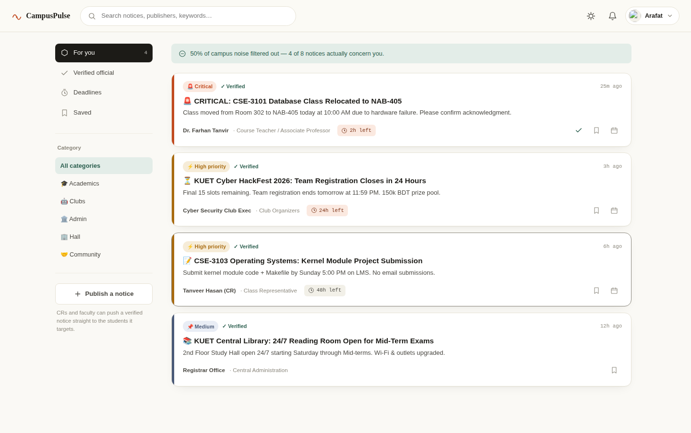

# CampusPulse

> A focused, personalised notice desk for KUET students, faculty, and class representatives.

CampusPulse turns scattered campus announcements into a calmer, more relevant feed. It highlights notices by department, batch, section, hall, and club membership so people can find urgent information without scrolling through unrelated group messages.



## Highlights

- Personalised notice feeds with urgency-based ranking
- Verified, deadline, and saved-notice views
- Read acknowledgements and bookmarks
- Morning briefing and iCalendar (`.ics`) deadline export
- Live updates over WebSockets
- Optional browser push notifications
- Dark mode and installable Progressive Web App (PWA)
- SQLite for local development and PostgreSQL for hosted deployments

## Tech stack

| Layer | Technology |
| --- | --- |
| Backend | Python, Flask, Flask-Sock |
| Frontend | Vanilla HTML, CSS, and JavaScript |
| Database | SQLite locally; PostgreSQL in production |
| Real-time | WebSockets |
| Deployment | Gunicorn + any Python-compatible host |

## Project structure

```text
campus-gpt-new/
├── app.py                  # Flask routes, database setup, and WebSockets
├── public/
│   ├── index.html          # Single-page application shell
│   ├── app.js              # Client-side UI and API calls
│   ├── styles.css          # Responsive styles and dark theme
│   ├── sw.js               # Service worker and push handler
│   └── manifest.json       # PWA manifest
├── requirements.txt        # Python dependencies
├── Procfile                # Production start command
└── .env.example            # Configuration reference
```

## Run locally

### Prerequisites

- Python 3.10 or newer
- `pip`

### Installation

```bash
git clone https://github.com/<your-username>/campus-gpt-new.git
cd campus-gpt-new

python -m venv .venv
```

Activate the virtual environment:

```powershell
# Windows PowerShell
.venv\Scripts\Activate.ps1
```

```bash
# macOS / Linux
source .venv/bin/activate
```

Install dependencies and start the app:

```bash
pip install -r requirements.txt
python app.py
```

Open [http://localhost:8000](http://localhost:8000). Create an account or sign in with an existing account to access the dashboard. On its first run, CampusPulse creates a local SQLite database and seeds sample notices for development.

On Windows, `Start-CampusPulse.bat` is also available as a convenient launcher.

## Configuration

CampusPulse reads configuration from environment variables. Local development works with no configuration; the app falls back to SQLite and generates a local session secret.

| Variable | Required in production | Purpose |
| --- | --- | --- |
| `SESSION_SECRET` | Yes | A long, random value used to sign session cookies |
| `DATABASE_URL` | Yes | PostgreSQL connection string, including SSL settings when required |
| `PORT` | Set by host | Port the web service listens on |
| `DB_FILE` | No | SQLite database location for local development only |

Never commit real secret values or database URLs. `.env.example` is a reference file; configure real values through your hosting provider's environment-variable settings.

## API overview

All API responses are JSON unless the route exports a calendar file. Authentication uses a session cookie.

| Area | Examples |
| --- | --- |
| Authentication | `POST /api/auth/signup`, `POST /api/auth/login`, `POST /api/auth/logout`, `GET /api/auth/me` |
| Notices | `GET/POST /api/announcements`, acknowledgement and bookmark routes |
| Personal tools | `GET /api/digest`, `GET /api/export-ics/<id>` |
| Operations | `GET /api/healthz`, `GET /api/push/config`, `WS /api/ws` |

## Deploying permanently

For a durable public deployment, use a managed Python web service and managed PostgreSQL rather than hosting the SQLite file on the app server. Render is one suitable option because it supports Flask/Gunicorn apps, custom domains, TLS, and WebSockets. Its filesystem is ephemeral by default, so the production database must be PostgreSQL (or another external managed database), not the local SQLite fallback.

1. Push this repository to GitHub.
2. Create a managed PostgreSQL database in the same region as your web service.
3. Create a Python web service connected to the repository.
4. Set the build command to `pip install -r requirements.txt`.
5. Use the repository's `Procfile`, or set the start command to:

   ```bash
   gunicorn --worker-class gthread --workers 1 --threads 8 --bind 0.0.0.0:$PORT app:app
   ```

6. In the host dashboard, set `DATABASE_URL` to the database's internal connection URL and set `SESSION_SECRET` to a freshly generated random value.
7. Configure `/api/healthz` as the health-check path.
8. Deploy, test the public URL, then attach a custom domain and update its DNS records.

Use a paid, always-on compute plan for a genuinely permanent service. Keep database backups enabled, set up uptime/error monitoring, and rotate secrets if they are ever exposed.

## Production readiness

Before inviting real users, complete these safeguards:

- Require an authenticated, authorised user for every state-changing route (publishing notices, changing preferences, acknowledgements, and bookmarks).
- Limit notice publishing to appropriate roles such as faculty and class representatives.
- Restrict CORS to the deployed domain instead of allowing every origin.
- Use PostgreSQL, a strong `SESSION_SECRET`, HTTPS, and managed database backups.
- Add automated tests for authentication, permissions, and critical feed behaviour.
- Add a `LICENSE` file and choose the terms under which others may reuse the project.

## Contributing

Issues and pull requests are welcome. For significant changes, please open an issue first so the approach can be discussed.

## License

No license file is currently included. Add the license you want (for example, MIT) before publishing the repository for others to reuse.
